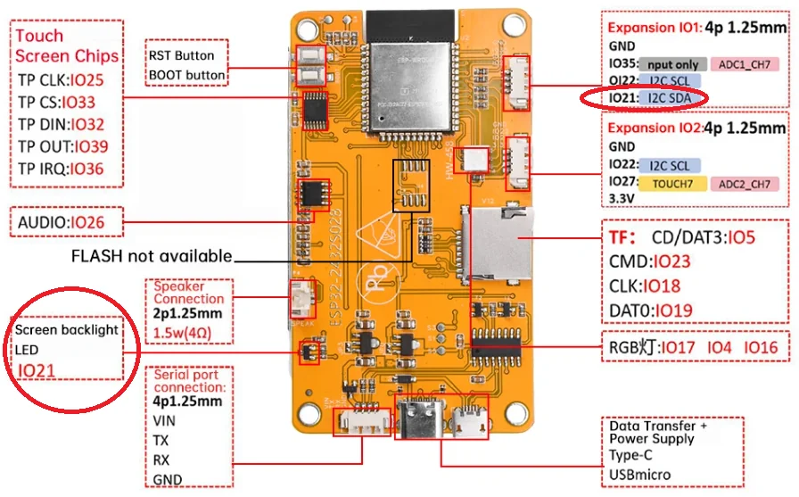
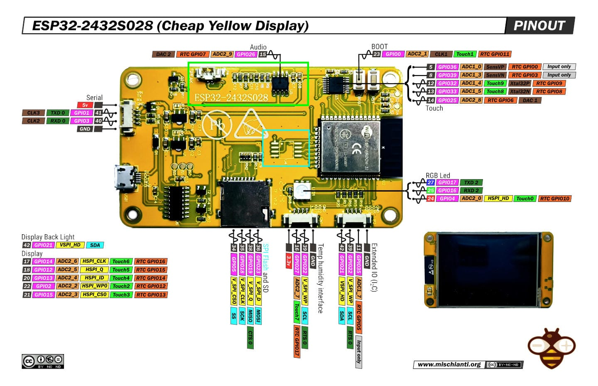
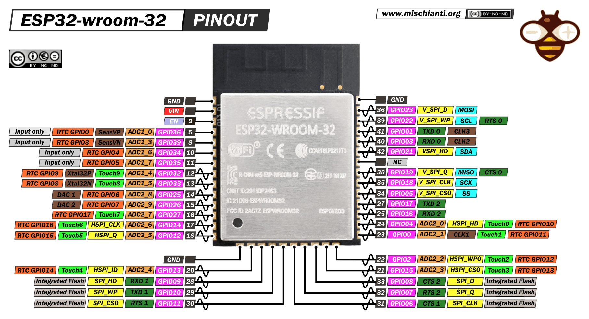

# Cheap Yellow Display

El **CYD (Cheap Yellow Display)** es una placa de desarrollo basada en el módulo **ESP32-WROOM-32**, diseñada para ofrecer una solución económica que integra **pantalla, entrada táctil y conectividad inalámbrica** en un solo dispositivo.


Excelente relación costo/funcionalidad. Permite construir interfaces gráficas embebidas, dashboards, dispositivos IoT y sistemas interactivos.

El ESP32 aporta potencia de procesamiento, conectividad Wi-Fi/Bluetooth y múltiples periféricos, mientras que el CYD agrega una capa visual e interactiva.

---

## 📊 Especificaciones clave

| Categoría | Detalles |
|----------|--------|
| **MCU** | ESP32-WROOM-32 (dual-core Xtensa LX6 @ 240 MHz, Wi-Fi b/g/n + Bluetooth v4.2) |
| **Flash / RAM** | 4 MB QSPI flash, 520 KB SRAM |
| **Display** | 2.8” TFT 240×320 (ILI9341), 65k colores, backlight en GPIO 21 |
| **Touch** | Resistivo, controlador XPT2046 (bus VSPI) |
| **Audio** | Amplificador PAM8002A 3W clase D, salida en GPIO 26 |
| **Almacenamiento** | micro-SD (hasta 32 GB) por VSPI |
| **I/O integrados** | LED RGB (GPIO 4/16/17, activo en LOW), LDR (GPIO 34) |
| **Botones** | BOOT (GPIO 0), RESET (EN) |
| **GPIO libres** | 35 (solo entrada), 22, 27 |
| **Alimentación** | 5V vía micro-USB, reguladores AMS1117 a 3.3V |
| **Consumo típico** | ≈ 115 mA con backlight al máximo |
| **Tamaño / peso** | 86 × 50 mm, ~50 g |

---

## 🧩 Arquitectura general del hardware

El CYD se organiza en varios bloques funcionales conectados al ESP32:

- **Display TFT (ILI9341)** → interfaz SPI (HSPI)
- **Touch resistivo (XPT2046)** → interfaz SPI (VSPI)
- **microSD** → comparte bus VSPI
- **Audio** → salida mediante GPIO (DAC/PWM)
- **Sensores integrados** → LDR conectado a ADC
- **Indicadores** → LED RGB activo en LOW

Esto permite una gran flexibilidad pero también implica que algunos periféricos **comparten buses**, lo cual requiere coordinación en software.

---

## 🧩 Mapa funcional

| Bloque | Interfaz | Pines ESP32 | Notas |
|-------|---------|------------|------|
| LCD (HSPI) | SPI | 12,13,14,15,2 | RST fijo en HIGH |
| Touch (VSPI) | SPI | 39,32,25,33,36 | |
| micro-SD | SPI | 19,23,18,5 | Comparte VSPI |
| Audio | DAC/PWM | 26 | Conector JST |
| LED RGB | GPIO | 4,16,17 | activo LOW |
| LDR | ADC | 34 | ADC1 |

---

## 📌 Pinout rápido

### 🔹 P1 (UART)

- VIN
- TX (GPIO 1)
- RX (GPIO 3)
- GND

👉 Uso: flasheo y consola serial

---

### 🔹 P3

- GND
- GPIO 35 (solo entrada)
- GPIO 22
- GPIO 21 (backlight)

⚠️ GPIO 21 está ligado al backlight → evitar reutilizar

---

### 🔹 CN1 (I2C recomendado)

- GND
- GPIO 22 (SCL)
- GPIO 27 (SDA)
- 3V3

---

### 🔹 P4 (Audio)

- GPIO 26
- GND

---

### 🔹 Botones

- BOOT → GPIO 0
- RESET → EN

---

## 🖥️ Display y Touch

### TFT ILI9341

- Resolución: 240x320
- Interfaz: SPI
- Colores: 65K
- Control de backlight por GPIO

### Touch XPT2046

- Tipo: resistivo
- Requiere calibración
- Menor precisión que capacitivo

---

## 🌐 Conectividad

El ESP32 incluye:

- Wi-Fi 802.11 b/g/n
- Bluetooth clásico
- Bluetooth Low Energy (BLE)

Esto permite implementar:

- servidores web embebidos
- APIs REST
- MQTT
- comunicación TCP/UDP

---

## ⚡ Alimentación

- Entrada: 5V por micro-USB
- Regulación: AMS1117 → 3.3V

⚠️ Recomendación:
- usar fuente estable
- evitar caídas de tensión (reinicios)

---

## 🛠️ Entorno de desarrollo

### Recomendado: PlatformIO

Ventajas:

- mejor manejo de dependencias
- integración con VS Code
- control de builds

---

## ▶️ Ejemplo básico

```cpp
#include <Arduino.h>

void setup() {
    Serial.begin(115200);
    Serial.println("ESP32 CYD listo");
}

void loop() {
    delay(1000);
}
```

---

## ⚠️ Consideraciones importantes

- Muchos periféricos comparten SPI → cuidado con conflictos
- Touch requiere calibración
- Uso intensivo de pantalla puede afectar rendimiento
- Algunos GPIO están reservados
- GPIO 35 es solo entrada

---

## 🧪 Problemas comunes

### Pantalla no funciona

- revisar configuración de pines
- validar librería TFT_eSPI

### Touch desalineado

- recalibrar valores

### Reinicios

- fuente insuficiente
- consumo alto del backlight

### USB no detecta

- drivers CH340/CP2102

---









## Otros enlaces de interes  relacionados :

* https://github.com/bueltan/handwall-e
* https://github.com/witnessmenow/ESP32-Cheap-Yellow-Display

